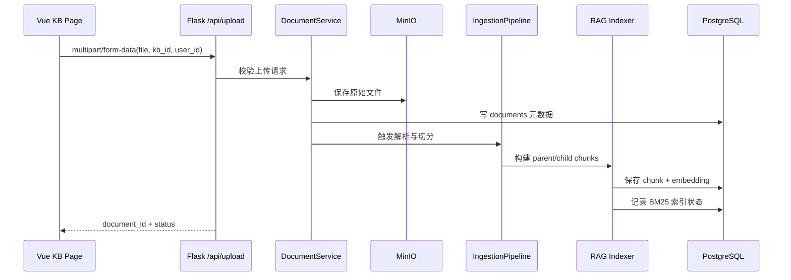
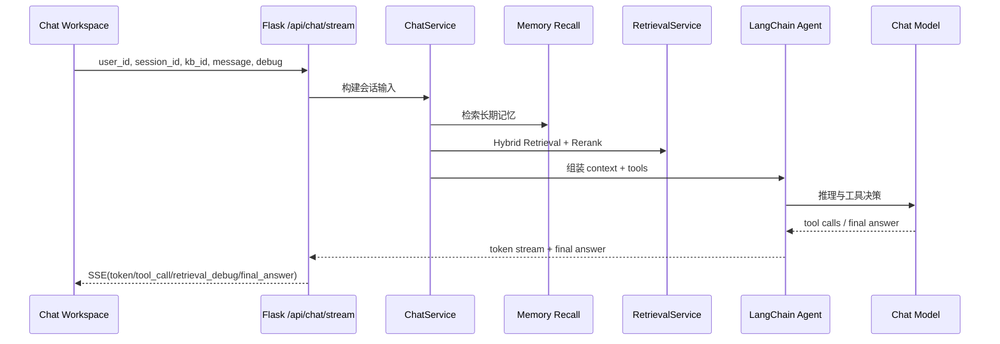
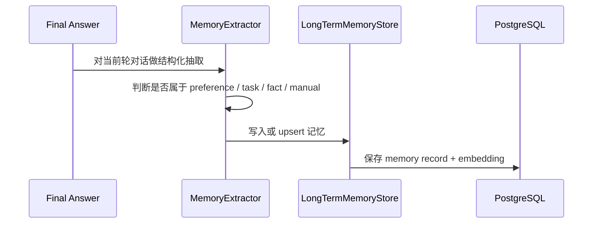

# 01 Architecture

## 你开发这一章时要先完成什么
- 启动基础依赖：`PostgreSQL + pgvector`、`MinIO`。
- 确认环境变量来源：根目录 [`.env.example`](/g:/学习空间夸克/练手项目/RAG_PRO/.env.example)。
- 先读后端入口 [backend/run.py](/g:/学习空间夸克/练手项目/RAG_PRO/backend/run.py) 和前端入口 [frontend/src/main.ts](/g:/学习空间夸克/练手项目/RAG_PRO/frontend/src/main.ts)。
- 约定本项目先不做登录鉴权，但所有资源都带 `user_id`。

## 项目定位
`ContextPilot` 是一个用于练手的大模型应用工程项目，目标不是做复杂业务，而是完整演示一条现代 AI 应用链路：

- 文档上传并构建知识库
- 基于 Hybrid Retrieval 的知识问答
- LangChain 1.2 Agent 工具调用
- LangGraph 风格的会话状态、Checkpoint、Long-term Memory
- Retrieval Debug 可视化
- Flask API + Vue 工作台前端

## 整体架构图
```text
Vue 3 Workspace
  ├─ Chat Workspace
  ├─ Knowledge Base
  └─ Memory Studio
        │
        ▼
Flask API
  ├─ /api/chat/stream
  ├─ /api/upload
  ├─ /api/documents
  ├─ /api/memory
  ├─ /api/retrieval/debug
  └─ /api/sessions
        │
        ▼
Application Layer
  ├─ Agent Runner
  ├─ Retrieval Service
  ├─ Document Service
  ├─ Memory Service
  └─ Session Service
        │
        ▼
LLM Layer
  ├─ LangChain create_agent
  ├─ Tool calling
  ├─ Context engineering
  └─ LangGraph memory/checkpoint abstraction
        │
        ▼
Infra Layer
  ├─ PostgreSQL + pgvector
  ├─ MinIO
  ├─ BM25 index snapshot
  └─ OpenAI-compatible API
```

## 目录与模块职责

| 模块 | 职责 | 当前骨架位置 |
| --- | --- | --- |
| Frontend | 页面、状态、交互和 Debug 可视化 | [frontend/src](/g:/学习空间夸克/练手项目/RAG_PRO/frontend/src) |
| API Layer | 参数校验、HTTP/SSE 协议、错误码 | [backend/app/api](/g:/学习空间夸克/练手项目/RAG_PRO/backend/app/api) |
| Service Layer | 业务用例编排 | [backend/app/services](/g:/学习空间夸克/练手项目/RAG_PRO/backend/app/services) |
| Repo Layer | 数据访问边界 | [backend/app/repos](/g:/学习空间夸克/练手项目/RAG_PRO/backend/app/repos) |
| Agent Layer | create_agent、tool、middleware | [backend/app/agent](/g:/学习空间夸克/练手项目/RAG_PRO/backend/app/agent) |
| RAG Layer | loader、splitter、hybrid、reranker、context builder | [backend/app/rag](/g:/学习空间夸克/练手项目/RAG_PRO/backend/app/rag) |
| Memory Layer | 记忆抽取、存储、召回 | [backend/app/memory](/g:/学习空间夸克/练手项目/RAG_PRO/backend/app/memory) |
| Ingestion Layer | 上传落盘、解析、建索引 | [backend/app/ingestion](/g:/学习空间夸克/练手项目/RAG_PRO/backend/app/ingestion) |
| ORM / DTO | 数据表与 API Schema | [backend/app/models](/g:/学习空间夸克/练手项目/RAG_PRO/backend/app/models) |

### 模块边界规则
- `api` 层不得直接写 SQL。
- `service` 层不得直接操作 `request` / `Response`。
- `repos` 层只做持久化，不编排业务流程。
- `agent/rag/memory/ingestion` 是可替换能力模块，方便后续从 mock 过渡到真实实现。
- 前端页面不直接写死接口路径，统一通过 `src/api/client.ts` 管理。

## 数据流设计

### 1. 文档上传与建库


### 2. RAG 问答


### 3. Memory 写入


### 4. Retrieval Debug
- 前端右侧调试面板读取 `/api/retrieval/debug` 或聊天流中 `retrieval_debug` 事件。
- 调试数据必须覆盖：
  - `vector_hits`
  - `bm25_hits`
  - `rrf_hits`
  - `rerank_hits`
  - `final_context`
  - `prompt_budget`
  - `tool_trace`

## 数据存储设计

### PostgreSQL + pgvector
- `sessions`：会话级别元数据。
- `messages`：完整消息历史与工具轨迹。
- `documents`：上传文件元数据。
- `document_chunks`：父块、子块、embedding、metadata。
- `memories`：用户长期记忆。
- `retrieval_logs`：检索调试链路留痕。

### MinIO
- 保存原始上传文件。
- 存储规则建议：`{kb_id}/{document_id}/{filename}`。
- 后续也可以保存 BM25 快照文件和抽取中间产物。

### BM25 Snapshot
- 每个 `kb_id` 单独维护索引。
- 开发期可以用本地磁盘；后续可切到对象存储。

## 核心非功能性要求
- 单用户 demo 起步，但数据模型必须全量带 `user_id`。
- SSE 是聊天主协议，便于流式 token、tool trace 和调试信息同步到前端。
- 前端要支持 `1440px` 桌面工作台和 `390px` 移动端收敛布局。
- 文档类问题优先依赖知识库；外网搜索必须显式开启。
- 回答必须保留 citation 能力，为后续面试演示留证据链。

## 开发顺序建议
1. 先打通上传、文档列表、会话列表、Memory 列表这四条普通 REST。
2. 再补 `/api/chat/stream` SSE 和前端流式消息区域。
3. 然后接入 Retrieval Debug payload。
4. 最后把 mock service 换成真实 LangChain / LangGraph / pgvector 实现。

## 当前骨架与后续真实实现的差异
- 目前仓库中的后端 service 是“接口完整、逻辑占位”的实现，目的是先稳定模块边界和 DTO。
- 目前前端展示使用 mock 数据驱动，目的是先稳定布局、组件信息密度和字段形状。
- 你后续开发时，应优先保持现有接口契约稳定，再逐步替换具体实现。

## 参考资料
- LangChain Agents: https://docs.langchain.com/oss/python/langchain/agents
- LangChain Context Engineering: https://docs.langchain.com/oss/python/langchain/context-engineering
- LangGraph Memory: https://docs.langchain.com/oss/python/langgraph/add-memory
- Flask App Factories: https://flask.palletsprojects.com/en/stable/patterns/appfactories/
- Vue Tooling: https://vuejs.org/guide/scaling-up/tooling.html
